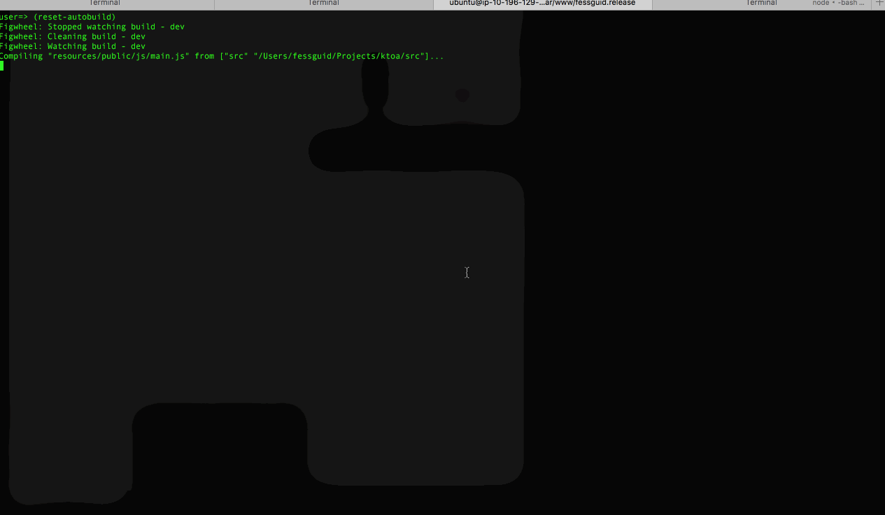

# om-next-cross-platform-template

lein-template for writing cross platform Om-Next components for the browser and for mobile devices using React Native

### Features

- Write cross platform Om-Next components: Just implement different `render` method for each platform
- Figwheel with nRepl support: Simultanoius live coding for multiple browsers and mobile clients
- iOS and Android support
- Transparent integration with React Native: No need to make any **any** modifications in your RN application
- Release build with advanced compilation mode supported - makes JS bundles 4 times smaller
- Sync state between clients in real time with just a few line of changes
- No magic hacks

### Status

Ready for testing

### Issues

- Warning: `Warning: Lm(...): React component classes must extend React.Component.`
- Dismiss RN error automatically. Remount on refresh, figwheel: ` :jsload-callback core/mount-root)`?
- Testing - how|what?

### Demo




### Usage

Be sure that all needed react native tools installed. See [getting started](http://facebook.github.io/react-native/docs/getting-started.html)

#### Create project:

``` bash
lein new om-next-cross-platform qwerty && cd qwerty
react-native init QwertyApp

# Run the native app
open QwertyApp/ios/QwertyApp.xcodeproj
# or
cd QwertyApp && react-native run-android

# Then compile and start the repl
lein clean && lein cljsbuild once repl && lein repl
```

By default only `index.ios.js` will be generated. For Android development change `:output-to` for `:repl` build to `AppName/index.android.js`.

For Android version we cannot use `localhost` to connect to Figwheel as it points to the actual device. You can resolve it by running `adb reverse tcp:3449 tcp:3449`

For browser development just open `http://localhost:3449`

#### Development

You only need to run `lein cljsbuild once repl` in case `src\repl.cljs` has changed. In other cases `lein repl` + open mobile project is enough

#### Release

- `lein with-profile mobile cljsbuild once release` - to genereate release build. Make sure that you have needed externs, or disable `advanced` optimization
- `cd QwertyApp && react-native bundle --entry-file release.js --bundle-output ios/js/main.jsbundle --platform ios` - to generate release bundle. Do the same for Android version

#### References

This project havily relies on [ktoa](https://github.com/artemyarulin/ktoa)

#### FAQ

See [wiki](https://github.com/artemyarulin/om-next-cross-platform-template/wiki)
